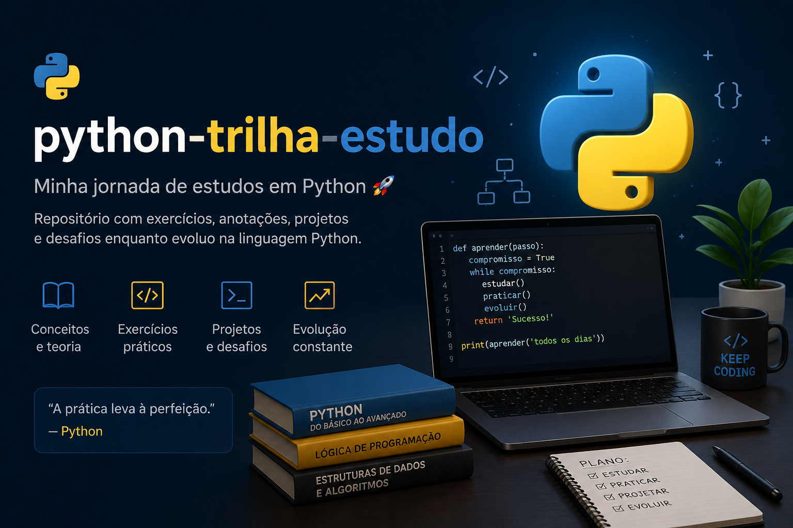

# python-trilha-estudo

[](https://www.python.org/)
[](https://github.com/tomaziu/python-trilha-estudo)

<p align="center">
  
</p>

Repositório com exercícios, anotações, projetos e desafios enquanto evoluo na linguagem Python.

---

## Como usar este repositório

Cada pasta representa um tópico de estudo, organizado do básico ao avançado. Siga a ordem dos módulos para uma evolução consistente:

1. Comece pelo `01_fundamentos` e avance sequencialmente
2. Cada pasta contém um `README.md` com a teoria e os exercícios
3. Cada exercício tem comentários explicando o código linha a linha
4. Tente resolver antes de olhar a resposta

```bash
# Navegue até a pasta do módulo
cd meu_estudo_python/01_fundamentos

# Execute o exercício
python exercicio_1.py
```

---

## Pré-requisitos

- [Python 3.x](https://www.python.org/downloads/) instalado
- Noções básicas de terminal (navegar pastas e executar comandos)
- Um editor de código (VS Code, PyCharm ou similar)

---

## Estrutura do repositório

| Módulo | Tópico | Conceitos |
|--------|--------|-----------|
| 01 | Fundamentos | variáveis, tipos, operadores, f-strings, input |
| 02 | Controle de Fluxo | if/elif/else, for, while, break, continue |
| 03 | Estruturas de Dados | listas, tuplas, dicionários, sets |
| 04 | Funções | def, return, parâmetros, *args, **kwargs, escopo |
| 05 | Strings | fatiamento, métodos, split, join, validação |
| 06 | Tratamento de Erros | try/except, finally, tipos de erro |
| 07 | Manipulação de Arquivos | open, read, write, with, modos r/w/a |
| 08 | Programação Orientada a Objetos | classes, herança, super, métodos especiais |
| 09 | Módulos e Biblioteca Padrão | random, datetime, os, math |
| 10 | Comprehensions | list comprehension, dict comprehension, set comprehension |
| 11 | Bibliotecas Externas | requests (APIs), pandas (análise de dados) |
| 12 | Boas Práticas | PEP8, type hints, virtualenv |
| 13 | Projeto Final | Gerenciador de Contatos (projeto integrador) |

---

## Como rodar

```bash
# Clone o repositório
git clone https://github.com/tomaziu/python-trilha-estudo.git

# Entre na pasta
cd python-trilha-estudo

# Execute qualquer exercício
python meu_estudo_python/01_fundamentos/exercicio_1.py
```

---

## Contato

- GitHub: [github.com/tomaziu](https://github.com/tomaziu)
